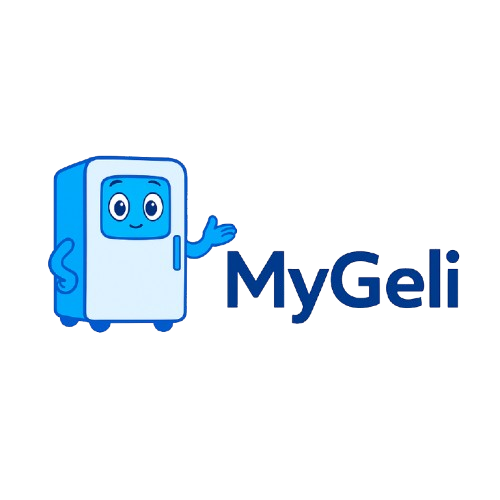

  

# MyGeli: Alimento Organizado, Consumo Responsável

### _Um assistente de cozinha inteligente para reduzir o desperdício de alimentos usando Inteligência Artificial._

---

## 🎯 Nosso Propósito

O MyGeli é uma solução inovadora que combate o desperdício doméstico de alimentos, um problema que representa cerca de **60% de todo o alimento descartado no Brasil**. Nosso projeto se alinha diretamente à **Meta 12.3 do Objetivo de Desenvolvimento Sustentável (ODS) 12 da ONU**, que visa reduzir pela metade o desperdício de alimentos per capita até 2030.

Utilizando o poder da Inteligência Artificial, nosso sistema transforma ingredientes que seriam esquecidos na geladeira em deliciosas receitas, promovendo um consumo consciente, gerando economia e contribuindo para um planeta mais sustentável.

---

## ✨ Funcionalidades Principais

* **🤖 Assistente Virtual Inteligente (Geli):** Potencializada pela API **Gemini 2.0 Flash**, a Geli analisa os ingredientes que você tem em casa e sugere receitas personalizadas e criativas.
* **🌿 Aproveitamento Integral:** Sugestão de receitas que utilizam sobras, partes não convencionais (cascas e talos) e alimentos próximos ao vencimento.
* **✅ Segurança Alimentar:** A IA é treinada para distinguir ingredientes comestíveis, garantindo que as receitas geradas sejam sempre seguras e viáveis.
* **📈 Monitoramento de Impacto:** O sistema fornece indicadores sobre o volume de alimentos que você reaproveitou, tangibilizando sua contribuição para a redução do desperdício.
* **💬 Interação Dinâmica:** Converse com a Geli para adaptar receitas, pedir substituições de ingredientes e ajustar o nível de complexidade das instruções em tempo real.

---

## 🛠️ Tecnologias Utilizadas

O protótipo do MyGeli foi construído com uma combinação de tecnologias de ponta para garantir robustez e uma ótima experiência de usuário:

| Tecnologia             | Propósito                                                |
| :--------------------- | :------------------------------------------------------- |
| **IA Generativa** | `Google Gemini 2.0 Flash`                 |
| **Linguagem Principal** | `Python`                                  |
| **Interface Gráfica** | `CustomTkinter`                           |
| **Banco de Dados** | `MySQL`                                   |
| **Bibliotecas de Suporte** | `Pillow`, `pathlib`, `subprocess`, `google.generativeai` |

---

## 🚀 Próximos Passos e Futuro do Projeto

Nosso protótipo desktop é totalmente funcional, mas nossa visão vai além. Estamos planejando:

* **📱 Desenvolvimento Mobile:** Criar uma versão multiplataforma (iOS/Android) para levar a Geli para a palma da sua mão.
* **🔌 Integração com IoT:** Conectar o MyGeli a geladeiras inteligentes para automatizar o inventário de alimentos, eliminando o cadastro manual.
* **💰 Modelos de Monetização:** Lançar uma **versão Premium** com funcionalidades avançadas e firmar **parcerias B2B** com supermercados e fabricantes de eletrodomésticos.

---

## 👥 Equipe de Desenvolvimento

Este projeto é o resultado do trabalho colaborativo de estudantes do **Curso Superior de Tecnologia em Inteligência Artificial** da **Fatec Rio Claro**, parte do Centro Paula Souza.

**Autores:**
* Elisa Almeida Alcântara
* Guilherme Peres Romanzotti
* Heitor Vitti Partezani
* César Augusto Oliveira Bovo
* Fábio Luís Henrique
* Luís Otávio Routh da Silva
* Marvin Cristhian Gomes Pinto
* Paulo Guilherme Moreira
* Raphael Culim Neves

**Suporte Técnico:**
* Cleberson Eugênio Forte
* Orlando Saraiva do Nascimento Júnior
* Henri Alves de Godói
* Gustavo Bonin Gava

---

## 🔗 Link do Projeto

Acesse o projeto e explore todos os nossos canais e informações através do link abaixo:

  

